# Autocarga PSR-4 con Composer - Arely Mendoza

Esta guía demuestra la implementación del estándar PSR-4 usando Composer Autoload para gestionar la carga automática de clases en PHP, eliminando por completo el uso de require e include manuales.

## Estructura del Proyecto con el estándar PSR-4

Para el ejemplo propuesto, en base a la estructura PSR-4 creamos carpetas y subcarpetas que nos permitirán individualizar e identificar secciones del código para trabajar. La función del autoload en este laboratorio es simple: en vez de estar escribiendo require para cada archivo PHP que necesites usar, Composer se encarga de encontrar y cargar las clases automáticamente cuando las necesitas.
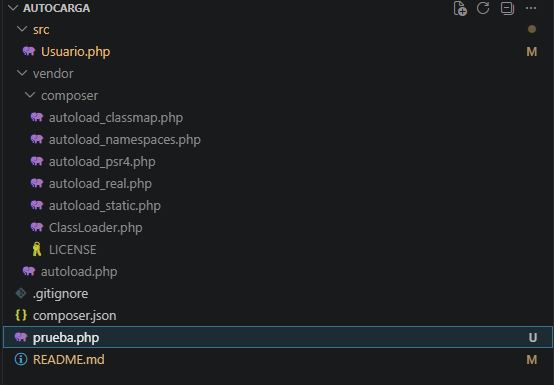

El estándar PSR-4 define una forma automatizada de cargar clases en PHP mediante un mapeo entre namespaces y directorios del sistema de archivos.

## Flujo de Trabajo — Paso a Paso

A continuación se documenta el proceso seguido para construir este proyecto desde cero, aplicando PSR-4.

### Paso 1 — Crear el proyecto y las carpetas
Se creó la carpeta raíz Autocarga/ y dentro de ella la estructura de directorios que respeta la jerarquía de namespaces definida por PSR-4:

La lógica es directa: si la clase va a pertenecer al namespace Database\Model, debe vivir físicamente en la carpeta src/Database/Model/. PSR-4 exige que esta correspondencia sea exacta, carácter por carácter.

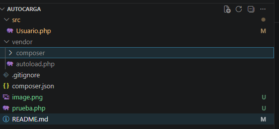

### Paso 2 — Crear las clases PHP

Cada archivo declara su namespace en la primera línea después de <?php. El namespace refleja exactamente la ruta de carpetas desde la raíz configurada.

Si hacemos una impresión sin el uso del composer el resultado nos dará el mismo, pero nos ralentiza el estar escribiendo require en cada clase para esperar una impresión, mejor utilicemos autoload instalándolo en la terminal, así nos agilizaremos un poco más.

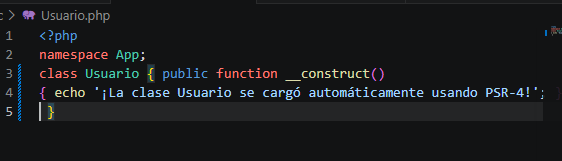
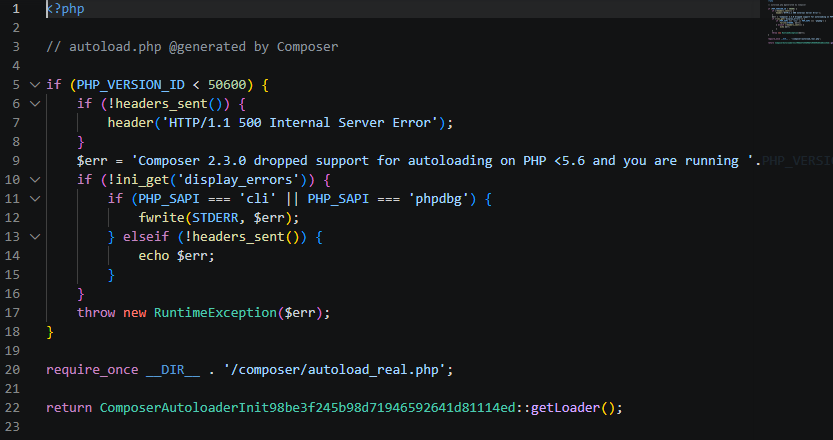

### Paso 3 — Configurar composer.json

Se creó el archivo composer.json en la raíz del proyecto con el siguiente contenido:

¿Qué hace este archivo específicamente?

Le dice a Composer dónde está cada clase según su namespace. App\ la busca en src/App/ y Database\ en src/Database/. Sin esto, tendrías que usar require para cada archivo manualmente. Así obtendremos la impresión que queremos para este ejemplo.

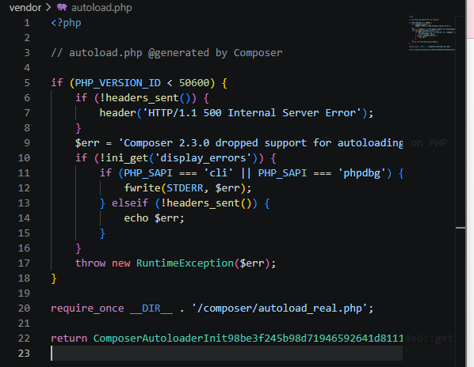

### Paso 4 — Ejecutar composer install

composer install

Este comando lee el bloque "autoload" del composer.json y genera automáticamente la carpeta vendor/ con todos los archivos internos necesarios para que PHP encuentre cada clase.

¿Por qué se crea la carpeta vendor/?

vendor/ es el directorio donde Composer almacena:
- Las dependencias de terceros
- El autoloader generado (vendor/autoload.php)

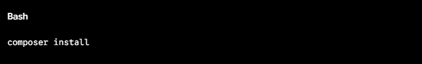
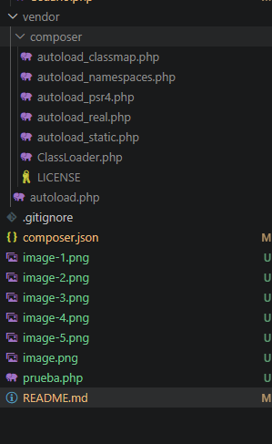

### Paso 5 — Pruebas con mi archivo Prueba.php

Al ejecutarlo directamente, no nos saldrá la impresión pero al estructurarlo como se mencionó anteriormente se reemplaza el require por el formato use. Después de ejecutarlo con la estructura correcta si nos saldrá la impresión.

¿Por qué ya no hay require para cada clase?

Porque la sentencia use no carga el archivo, simplemente crea un alias corto dentro del archivo actual para no tener que escribir el namespace completo cada vez.

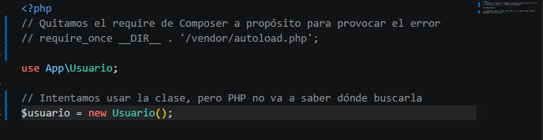
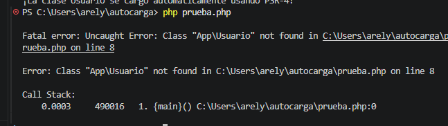
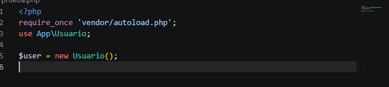
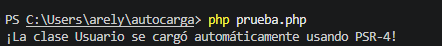

### Paso 6 — Creación del archivo gitignore

Este último antes de subirlo a mi repositorio excluimos la carpeta vendor, ¿con qué finalidad? Demostrar que el composer.json está bien configurado si se llega a clonar un repositorio como prueba, si el proyecto funciona correctamente después de regenerar el vendor/ desde cero.

## Conclusiones Técnicas

### Mantenibilidad

Agregar nuevas clases al proyecto no requiere modificar ningún archivo de configuración global. Basta con respetar la convención de carpetas y declarar el namespace correcto. El autoloader de Composer resuelve todo en tiempo de ejecución.

### Eficiencia de Memoria — Lazy Loading

Composer solo carga en memoria las clases que realmente se instancian durante una petición. En un proyecto con 200 clases donde una petición específica solo usa 15, las otras 185 nunca se cargan, reduciendo el consumo de RAM y mejorando el tiempo de respuesta del servidor.

### Estandarización PSR-4

Seguir PSR-4 garantiza una buena estructuración con el ecosistema PHP completo. Frameworks como Laravel siguen este mismo estándar. Esto permite integrar cualquier librería externa sin conflictos y facilita la incorporación de nuevos desarrolladores al equipo.

## Información del Estudiante
- Nombre: Arely Mendoza
- Cédula: 20-36-7667
- Correo: arely.mendoza@utp.ac.pa
- Curso: Desarrollo de Software 7
- Fecha de Ejecución del Laboratorio: 19-05-26
- Instructor del Laboratorio: Irina Fong